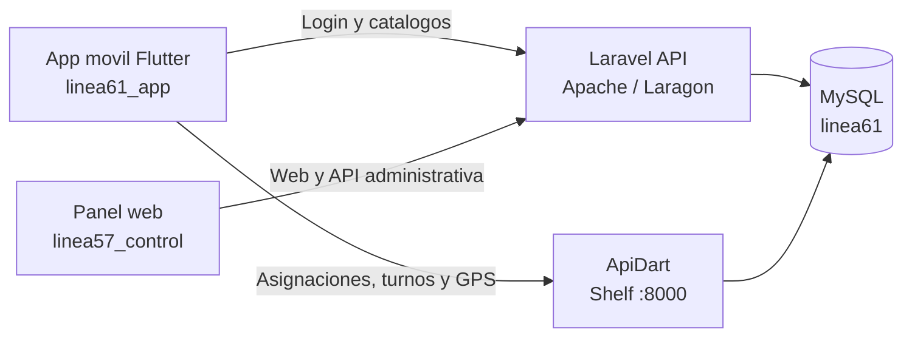
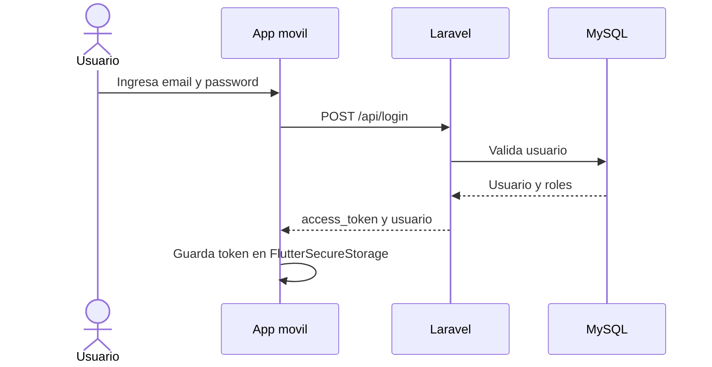
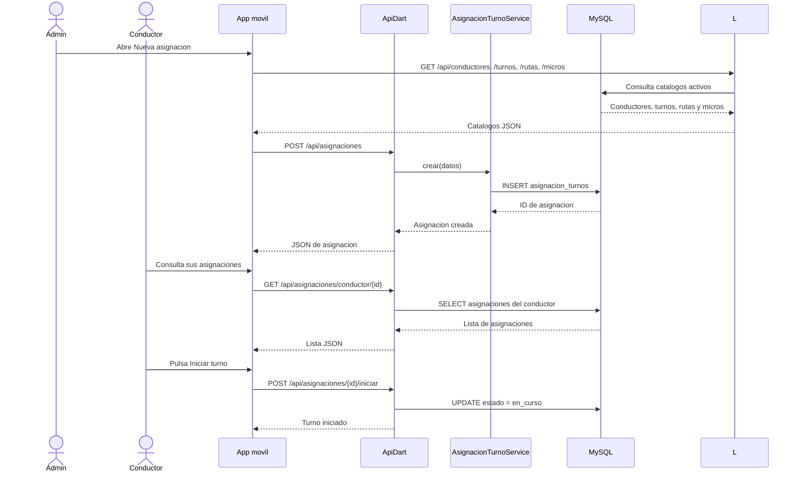
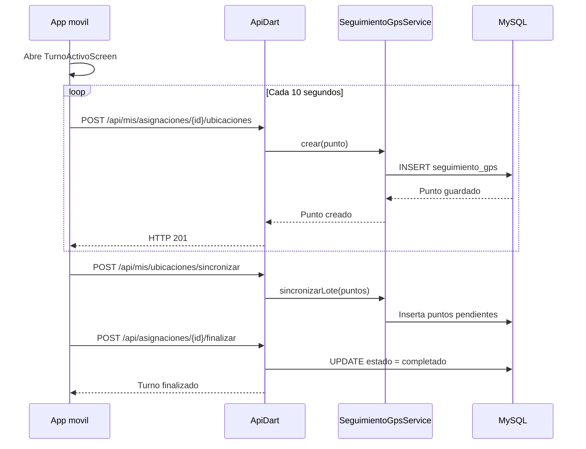

# Guia del flujo transaccional de Linea 61

## 1. Arquitectura actual

La solucion utiliza tres proyectos y una base de datos compartida:



La app movil y el panel web no se llaman directamente. Cada uno consume una API y ambas APIs consultan la misma base MySQL.

## 2. Puertos y URLs

| Componente | Desarrollo local | Funcion |
| --- | --- | --- |
| Laravel en Laragon | `http://10.0.2.2/api` | Login, roles y catalogos |
| ApiDart | `http://10.0.2.2:8000/api` | Transacciones moviles y GPS |
| MySQL | `127.0.0.1:3306` | Persistencia compartida |

En el emulador Android, `10.0.2.2` representa al PC anfitrion. Para un telefono fisico se debe usar la IP LAN del PC. La app envia `Host: linea57_control.test` para seleccionar el virtual host de Laravel en Apache.

## 3. Flujo de inicio de sesion



Archivos involucrados:

- App: `linea61_app/lib/services/api_service.dart` y `lib/providers/auth_provider.dart`.
- Laravel: `routes/api.php` y `app/Http/Controllers/Api/AuthController.php`.
- Persistencia: tabla `users` y tokens Sanctum.

## 4. Flujo de asignacion movil



Archivos principales:

- App: `lib/screens/asignacion_turno/asignacion_turno_form_screen.dart`.
- App: `lib/screens/asignacion_turno/asignacion_turno_list_screen.dart`.
- App: `lib/providers/asignacion_turno_provider.dart`.
- ApiDart: `lib/routes/routes_asignacion_turno.dart`.
- ApiDart: `lib/services/asignacion_turno_service.dart`.
- ApiDart: `lib/models/asignacion_turno.dart`.

## 5. Flujo de GPS y finalizacion



La pantalla movil muestra el estado GPS, los puntos enviados y la hora del ultimo reporte. El boton manual de envio fue retirado para evitar envios duplicados. El temporizador se cancela al finalizar el turno o cerrar la pantalla.

Archivos principales:

- App: `lib/screens/asignacion_turno/turno_activo_screen.dart`.
- App: `lib/providers/asignacion_turno_provider.dart`.
- ApiDart: `lib/routes/routes_conductor_endpoints.dart`.
- ApiDart: `lib/services/seguimiento_gps_service.dart`.
- ApiDart: `lib/services/control_recorrido_service.dart`.

## 6. ApiDart por dentro

El arranque se realiza en `bin/server.dart`:

1. `Database.connect()` abre MySQL.
2. Se crea un `Router` de Shelf.
3. Se montan las rutas de autenticacion, asignaciones, GPS y catalogos.
4. Se agrega CORS y logging.
5. `serve()` escucha en el puerto `8000`.

La responsabilidad transaccional se separa asi:

- `routes/`: recibe HTTP, valida parametros basicos y llama servicios.
- `services/`: ejecuta consultas e inserciones en MySQL.
- `models/`: convierte filas y JSON a objetos Dart.
- `database/`: abre la conexion compartida con `linea61`.

## 7. Control de recorrido

Laravel contiene la comparacion geografica en:

```text
linea57_control/app/Services/ControlRecorridoService.php
```

Ese servicio busca la siguiente parada, calcula distancia Haversine y usa una tolerancia de 80 metros. Sin embargo, el flujo movil actual envia el GPS a ApiDart. Por ello, la comparacion de Laravel no se ejecuta automaticamente con cada punto guardado por ApiDart.

Para una integracion completa se debe elegir una unica responsabilidad:

- Mover la comparacion geografica a ApiDart, o
- Hacer que ApiDart llame a Laravel despues de guardar cada punto.

No se debe duplicar la misma regla en ambos backends.

## 8. Arranque local

1. Abrir Laragon y arrancar Apache y MySQL.
2. Iniciar ApiDart una sola vez:

```powershell
cd C:\Users\Usuario\AndroidStudioProjects\ApiDart
dart run bin/server.dart
```

3. Ejecutar la app:

```powershell
cd C:\Users\Usuario\AndroidStudioProjects\linea61_app
flutter run
```

Si el puerto `8000` esta ocupado, ApiDart ya esta ejecutandose. No se debe iniciar una segunda instancia.

## 9. Validacion

```powershell
# App movil
flutter analyze
flutter test

# ApiDart
dart analyze
dart test

# Laravel
php artisan test
```

La autorizacion de las rutas transaccionales de ApiDart debe reforzarse antes de produccion para validar el token Sanctum de Laravel; la app movil actualmente usa Laravel para autenticarse y envia ese token en las solicitudes.
